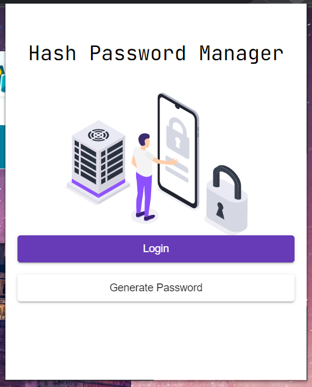
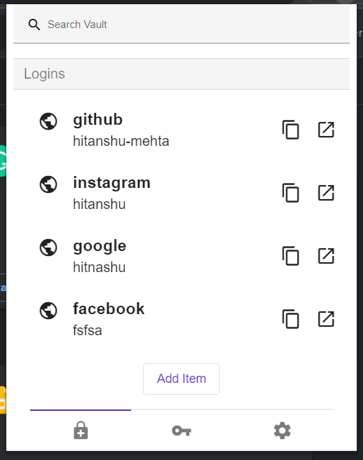

# Hash browser extension
Chrome Extension of Hash Password Manager. This project is divided into two repositories. 
All APIs used for encryption/decrytion and random hash generation is present at  [sarvagab/hash-password-manager](https://github.com/sarvagyab/hash-password-manager 
). 

# Functionalities
- Vault to store credentials encrypted using master password
- Crytographically secure password generator
- Password strength checker
- Auto-fill credentials (WIP)

# Screenshots

